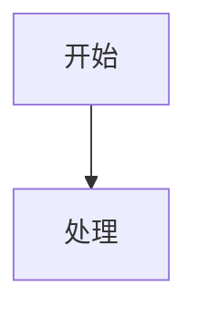

# Wiki.js Markdown Reference

Official basis checked on 2026-06-29:

- Wiki.js Markdown editor: https://docs.requarks.io/editors/markdown
- Wiki.js Media Assets: https://docs.requarks.io/guide/assets
- Wiki.js Folder Structure & Tags: https://docs.requarks.io/guide/structure
- Wiki.js Git storage: https://docs.requarks.io/storage/git

## Renderer Baseline

Wiki.js Markdown supports the full CommonMark specification plus useful extensions, including GitHub Flavored Markdown add-ons. Use standard Markdown first, then Wiki.js-specific classes only where they improve rendering.

Git storage syncs the whole wiki repository. The official Git storage guide describes a dedicated repository, bi-directional sync, scheduled sync, manual force sync, and manual import/add-untracked actions. Treat local files as live wiki storage.

## Headings

Use ATX headings:

```markdown
# 一级标题
## 二级标题
### 三级标题
```

Keep heading levels sequential. One visible `#` heading is usually enough for a page title or first major topic. Do not skip from `#` to `####`.

Wiki.js derives breadcrumbs and virtual folders from page paths. For nested sections, consider whether parent landing pages should exist, for example a path like `/证券/交易/A股/过户费` benefits from useful parent pages.

## Links

Use standard Markdown links:

```markdown
[链接文字](https://example.com)
[站内页面](/证券/交易/A股/过户费)
```

Prefer site-root absolute paths for internal wiki links. Do not include local drive paths. Avoid Obsidian-style `[[Page]]` links unless the local wiki has proven support.

## Images And Assets

Use standard image syntax:

```markdown

```

For repository pages, prefer paths that Wiki.js can serve:

- Organized page assets: `/assets/image/page/家庭组网拓扑.png`
- Shared page assets: `/assets/image/page/中国产业园区分类.png`

Wiki.js supports dimensions at the end of the image path:

```markdown


```

Use alt text that describes the content, not only the file name. When adding new asset folders through Wiki.js, observe official folder naming limits: no spaces, no uppercase Latin characters, only dash and underscore as special characters, at least two characters, and no leading/trailing special character.

## Tables

Use GitHub-style tables and keep a blank line before and after:

```markdown
| 项目 | 说明 |
|:----|:----|
| A | 内容 |
| B | 内容 |
```

Wiki.js supports a compact table style:

```markdown
| 项目 | 说明 |
|:----|:----|
| A | 内容 |
| B | 内容 |
{.dense}
```

Use `{.dense}` for wide or data-heavy tables. Keep cells short; move long explanations below the table.

## Footnotes

Use footnotes for sources and side notes:

```markdown
正文中的断言需要来源。[^source-1]

[^source-1]: 作者. 题名. 发布者, 发布日期 [引用日期]. URL.
```

Every footnote marker must have exactly one definition. Prefer descriptive IDs such as `[^csrc-2024-rule]` over fragile numeric IDs when the page is long.

## Admonitions

Wiki.js styles blockquotes with a class placed on the next line:

```markdown
> 需要读者注意的内容。
{.is-info}
```

Supported local classes from official docs:

- `{.is-info}` for neutral notes
- `{.is-success}` for positive confirmations
- `{.is-warning}` for cautions
- `{.is-danger}` for risks or prohibitions

For blockquotes that contain nested lists or ambiguous content, use decorate syntax so the class applies to the blockquote:

```markdown
> 注意：
> - 第一项
> - 第二项
<!-- {blockquote:.is-warning} -->
```

## Content Tabs

Use Wiki.js tabsets for alternative examples, jurisdictions, or methods:

```markdown
## 示例 {.tabset}

### 用法

这里是第一个标签页。

### 注意事项

这里是第二个标签页。
```

The parent heading with `{.tabset}` is not shown in the final result. Child tab headings must be exactly one level deeper.

## Lists

Use `-` for unordered lists. Use ordered lists when sequence matters:

```markdown
1. 第一步
1. 第二步
1. 第三步
```

Wiki.js/GFM supports task lists:

```markdown
- [x] 已完成
- [ ] 待处理
```

Wiki.js-specific list classes include `{.grid-list}` and `{.links-list}`. Use them sparingly and only for navigation or link collections.

## Code And Keys

Use fenced code blocks with a language:

````markdown
```powershell
npm run build
```
````

For keyboard keys, Wiki.js supports HTML keyboard tags:

```markdown
按 <kbd>CTRL</kbd> + <kbd>C</kbd> 复制。
```

Avoid raw HTML for layout. Markdown should remain readable in Git diffs.

## Diagrams

Wiki.js supports Mermaid and PlantUML fenced code blocks:

````markdown


```plantuml
Bob -> Alice : hello
```
````

Use diagrams when they explain process, topology, dependencies, or decision logic better than prose. Keep diagram labels short and Chinese-readable.

## Inline Formatting

Supported syntax includes:

- `**加粗**`
- `*斜体*`
- `` `行内代码` ``
- `~~删除线~~`
- `~下标~`
- `^上标^`
- `:emoji_identifier:`

Use emphasis sparingly. Prefer headings, lists, and tables for structure.

## Final Render Checklist

- Front matter starts at the first line and closes before body Markdown.
- There is a blank line before headings after front matter.
- Tables, fenced code blocks, tabsets, and blockquote classes have surrounding blank lines.
- Every image path starts with `/` or `https://`.
- Every footnote marker has a definition.
- No unresolved placeholders such as `TODO`, `待补充`, or fake citations remain unless the user explicitly wants a draft.
- No unsupported syntax such as MDX components or Obsidian backlinks is introduced.
