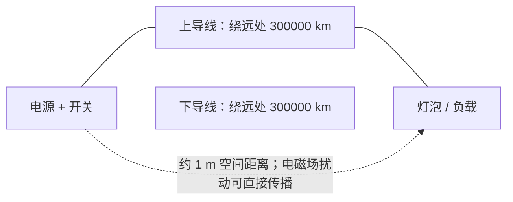

# 问题

本文把这个题称为 **Veritasium 灯泡问题**。它来自 Veritasium 频道视频 *The Big Misconception About Electricity*。题目大意是：有一个电源、一个开关、一个灯泡，以及两根各长 `300000 km` 的导线。两根导线向远处绕出去再回来，最终接到灯泡；但是电源和灯泡在空间中只相距约 `1 m`。合上开关之后，灯泡多久会亮？候选答案包括 `0.5 s`、`1 s`、`2 s`、`1 m / c` 或“以上都不是”。[^veritasium-video][^lenz-arxiv]

这里的“灯泡”更适合理解成一个可以检测电功率的负载。若换成真实白炽灯，“可见发光”还会受灯丝热惯性、阈值亮度和人眼感知影响，这些已经不是原题真正想考察的电磁传播问题。

# 示意图

不是比例图：关键是导线很长，但电源/开关与灯泡在空间中很近。

# 核心结论

> 如果“亮”定义为负载端**开始出现非零电压和功率**，理想化答案约为：
>
> $$t \approx \frac{1\,\mathrm{m}}{c} \approx 3.3\,\mathrm{ns}$$
>
> 如果“亮”定义为达到最终稳定亮度，则不能只回答 `1 m / c`。达到稳态需要考虑沿长导线传播的电磁波、远端反射、导线损耗、特性阻抗和灯泡阻值，时间尺度会和 `300000 km` 导线有关。
{.is-info}

这个结论最容易误解的地方在于：电路中的能量不是像水管里的水那样“被电子一路搬到灯泡”。电磁能量储存在电场和磁场中，能流方向可用 Poynting 矢量描述。Feynman Lectures 在讨论电磁场能量守恒时给出能流矢量，并说明它表示场能在空间中的流动速率；在电阻导线例子里，能量流入导线并转化为热。[^feynman-poynting]

# 解题思路

## 先区分两个问题

1. **最早什么时候有响应？**  
   开关闭合后，附近的电场、磁场开始重新分布。这个扰动以不超过光速的速度在空间和导线周围传播。因为电源与灯泡空间距离约 `1 m`，所以灯泡端最早可能在约 `1 m / c` 后感受到变化。

2. **最终什么时候稳定？**  
   两根超长导线本身仍然重要。它们不是瞬间成为“普通导线”，而是一对传输线。沿导线传播、到远端反射、再回到灯泡的波会逐步改变灯泡两端的电压和功率。因此稳态建立时间不是 `3.3 ns`，而与导线长度、介质中的传播速度和阻抗匹配有关。

## 为什么不是等电子跑完整根线

导线中的电子漂移速度通常很慢，不可能用“电子从电源一路跑到灯泡”的图像解释灯泡很快有响应。真正传播的是电磁场的变化。导线的作用是给场提供边界条件，决定电场、磁场如何分布以及能量如何被引导到负载附近。

这并不违反相对论：没有信息超光速传播。只是原题里的最近传播路径不是“沿导线绕完 `300000 km`”，而是电源/开关到灯泡之间约 `1 m` 的空间区域。

# 传输线解法

更精细地看，两根长导线可以视为传输线。传输线不是一个集中电阻，而是分布的电感与电容；电压、电流以波的形式沿线传播。Lenz 的实验论文也用这种模型解释测量结果：同轴线或双导线可以建模为许多微小电感、电容组成的网络，最终表现为电压波和电流波沿线传播。[^lenz-tline]

在对称、理想化的模型中，开关闭合后的最初一小段时间，长导线对负载附近看起来像各自的特性阻抗 \(Z_0\)。如果电源电压为 \(U_s\)，灯泡等效为电阻 \(R\)，且两侧导线的特性阻抗都近似为 \(Z_0\)，则负载最初得到的电压可近似写成：

$$U_R(0^+) \approx U_s \frac{R}{R + 2Z_0}$$

这个式子说明两件事：

- 初始功率不一定等于最终直流功率；
- 只要耦合和阻抗不是极端情况，负载可以在极早时间获得非零功率。

随后，沿长导线跑出去的波会在远端、负载端继续反射和透射。反射系数常写为：

$$r=\frac{Z_2-Z_1}{Z_2+Z_1}$$

所以每次反射都会按阻抗关系改变负载端电压。换句话说，`1 m / c` 回答的是“第一下有无响应”，传输线反射回答的是“响应如何逐步变成最终状态”。[^lenz-reflection]

# 后续实验

Michael Lenz 在 2025 年发布的 arXiv 论文 *The Cable to the Moon: Veritasium's Light Bulb Experiment in Low-Cost Miniature Form* 记录了一个缩小版实验。该实验来自 2022 年 Saxon Physics Olympiad 的 Physics Specialist Camp，学生制作了 PCB，用 `2.5 V` 直流电源、约 `10 ns` 开关时间的 MOSFET、两根 `10 m` 同轴电缆、负载电阻和放大测量电路来模拟原题。[^lenz-setup]

实验先测得 `10 m` 同轴电缆的信号延迟约为 `44 ns`，对应传播速度约 `2.27 × 10^8 m/s`，约为真空光速的 `3/4`。[^lenz-speed]

在 `150 Ω` 负载下，开关真正动作后，负载电压几乎同时发生变化。论文报告说，第一个 `88 ns` 时间段内负载电压几乎立刻从 `0` 升到 `1.5 V` 并保持；下一个 `88 ns` 时间段内又从 `1.5 V` 升到约 `2.5 V`。在 `30 Ω` 负载下，可以看到多个持续约 `88 ns` 的阶跃。[^lenz-results]

这个实验没有真的使用 `300000 km` 导线，但它验证了原题的关键机制：负载端的最早响应可以非常快出现，而最终电压会通过长线传播和反射逐步建立。

# 常见误区

## 误区一：能量必须沿导线绕一整圈

导线并不是“能量管道”的全部。电磁能量在导线周围的场中流动，导线主要塑造边界条件并引导场。长导线当然影响后续反射和稳态，但不要求最早响应必须等完整导线传播完毕。

## 误区二：`1 m / c` 就等于肉眼看到灯泡变亮

原题里的“亮”更像“负载开始收到功率”。真实灯泡是否肉眼可见，还取决于灯丝加热、亮度阈值和观察方式。用高速示波器看负载电压，与用肉眼看白炽灯，是两个不同的问题。

## 误区三：答案与导线形状完全无关

最早响应依赖空间几何、导线间距、介质、屏蔽、负载阻抗和开关上升时间。`1 m / c` 是原题理想图像下的数量级答案，不是任意布线、任意灯泡、任意阈值下的万能数字。

# 小结

这个题的漂亮之处不在于“猜一个时间”，而在于逼人放弃过度简化的电路直觉：闭合开关后，电路首先是一个电磁场问题，其次才可以在低频稳态下近似成普通的集中元件电路。

简短回答是：**若问最早有响应，约 `1 m / c`，也就是 `3.3 ns`；若问最终稳定亮度，则要用传输线和反射来算，不能只凭原题给出一个唯一时间。**

[^veritasium-video]: Veritasium. *The Big Misconception About Electricity*. YouTube, [引用日期: 2026-06-30]. https://www.youtube.com/watch?v=bHIhgxav9LY
[^lenz-arxiv]: Michael Lenz. *The Cable to the Moon: Veritasium's Light Bulb Experiment in Low-Cost Miniature Form*. arXiv:2501.03896, 2025-01-07 [引用日期: 2026-06-30]. https://arxiv.org/abs/2501.03896
[^feynman-poynting]: Richard P. Feynman, Robert B. Leighton, Matthew Sands. *The Feynman Lectures on Physics*, Vol. II, Ch. 27: Field Energy and Field Momentum. Caltech, [引用日期: 2026-06-30]. https://www.feynmanlectures.caltech.edu/II_27.html
[^lenz-tline]: Michael Lenz. *The Cable to the Moon: Veritasium's Light Bulb Experiment in Low-Cost Miniature Form*. arXiv:2501.03896, Section III.3.1, 2025 [引用日期: 2026-06-30]. https://arxiv.org/abs/2501.03896
[^lenz-reflection]: Michael Lenz. *The Cable to the Moon: Veritasium's Light Bulb Experiment in Low-Cost Miniature Form*. arXiv:2501.03896, Section III.3.2, 2025 [引用日期: 2026-06-30]. https://arxiv.org/abs/2501.03896
[^lenz-setup]: Michael Lenz. *The Cable to the Moon: Veritasium's Light Bulb Experiment in Low-Cost Miniature Form*. arXiv:2501.03896, Sections I-II, 2025 [引用日期: 2026-06-30]. https://arxiv.org/abs/2501.03896
[^lenz-speed]: Michael Lenz. *The Cable to the Moon: Veritasium's Light Bulb Experiment in Low-Cost Miniature Form*. arXiv:2501.03896, Section III.1, 2025 [引用日期: 2026-06-30]. https://arxiv.org/abs/2501.03896
[^lenz-results]: Michael Lenz. *The Cable to the Moon: Veritasium's Light Bulb Experiment in Low-Cost Miniature Form*. arXiv:2501.03896, Section III.2, 2025 [引用日期: 2026-06-30]. https://arxiv.org/abs/2501.03896

# AI辅助说明

> 本页曾使用 AI 工具辅助创作或修订。
>
> - AI工具/模型：OpenAI GPT-5 Codex
> - 参与方式：根据用户指定题目整理题干、示意图、解题思路、传输线模型、后续实验和来源脚注
> - 人工核验：未完成
> - 最后核验日期：未完成
{.is-warning}
